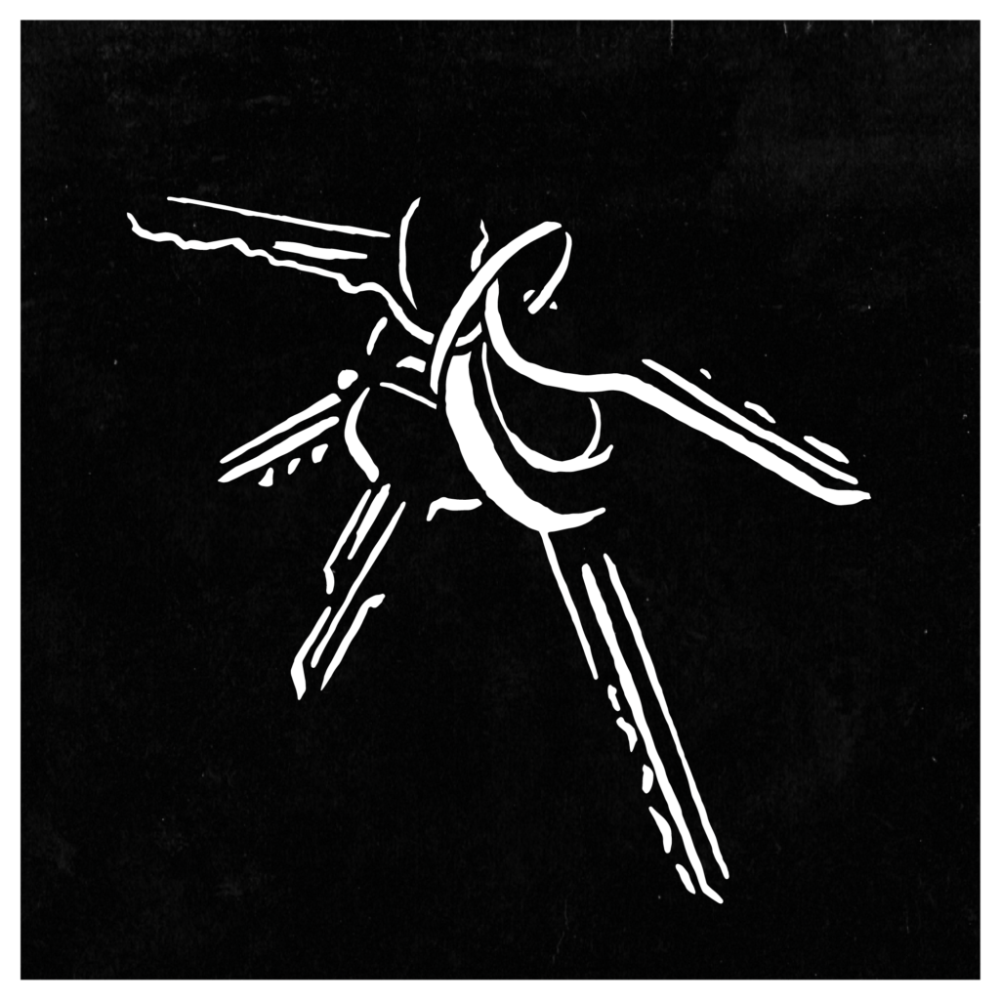
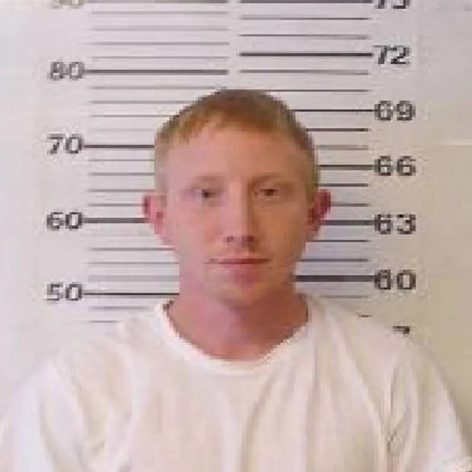
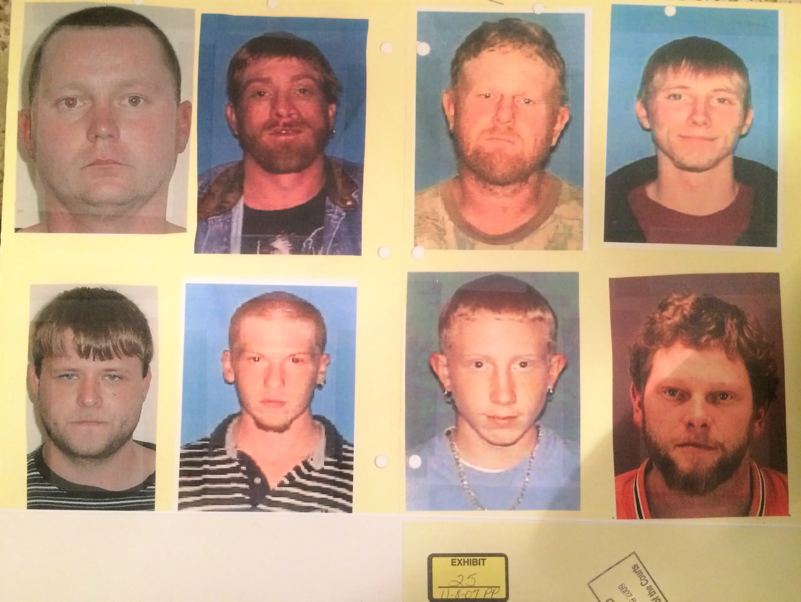
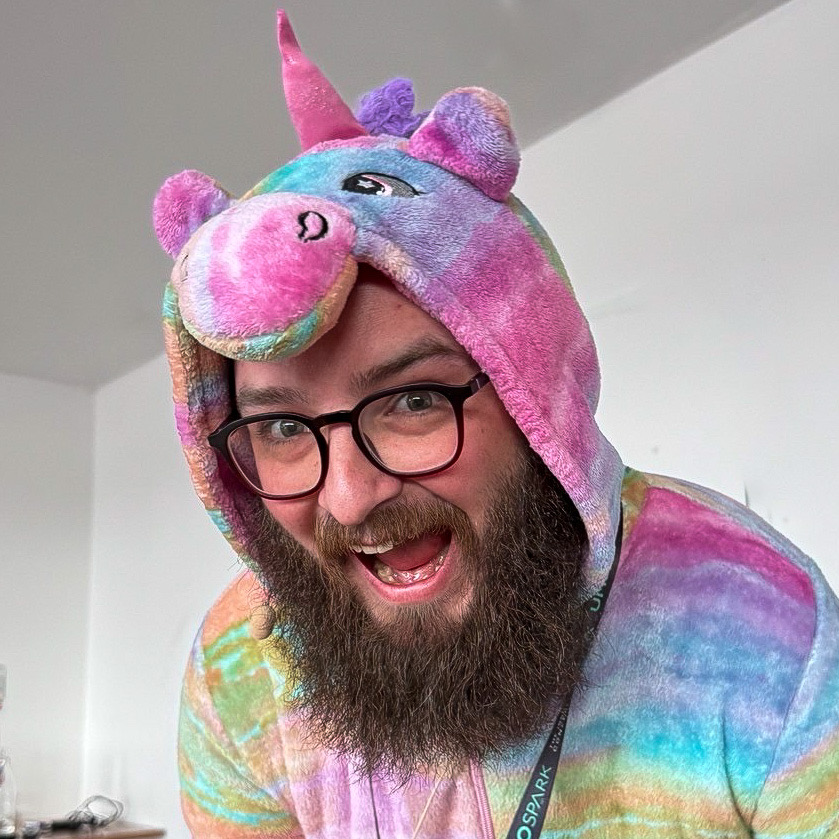

<!--
_header: ''
_backgroundImage:
_class: lead
_footer: '[Content warning: discussion of murder]'
--->

# Celibrate you're misteaks
Joe Glombek

---

> ## *Everyone* makes mistakes.

<!--  -->

<!--- We've heard it time and again. But there's always that nagging voice inside our heads telling us to hide it away somewhere. -->
---

<!--
_header: ''
_footer: ''
--->

## <small>Hello, my name is</small> Joe *Glombek*
*.NET* Web Developer at Bump Digital
*Umbraco MVP*

 
 

- <i>link</i> www.**joe.gl**
- <i></i> @Joe@UmbracoCommunity.Social

---

## Why do we *hide* our mistakes?

* <i>sentiment_very_dissatisfied</i> Embarrassment <!--I can do better attitude-->
* <i>psychology_alt</i> Imposter syndrome
* <i>emoji_events</i> We'd rather talk about *successes* than failures <!-- It's human nature! -->

    > the human inclination is to put our heads in the sand once we’ve embarked on our path [...] if we’ve gone off track, we grit our teeth, continue and hope for the best

<cite>[The learning opportunities hiding in our failures - BBC](https://www.bbc.com/worklife/article/20200616-the-learning-opportunities-hiding-in-our-failures)</cite>

---
<!--  -->

## The cost of *hiding mistakes*

***Content warning:* discussion of murder**

---

### The murder of *Malcolm Burrows*

* Malcolm Burrows was murdered outside his home in Tennessee.
* Witnesses described a man with red hair, driving away in a gold car.

<small>[Criminal podcast #133: *Red Hair, Gold Car*](https://thisiscriminal.com/episode-133-red-hair-gold-car/)</small>

---

### The wrongful conviction of *Adam Braseel*

<blockquote>Does anybody know anybody with red hair?</blockquote>

* Adam had red hair, and it turns out he'd been driving his mum's gold car nearby that day.
* With no physical evidence, only witness identification, he was convicted and jailed for life <!--- no motive, didn't know the victim -->

---

#### The *mistakes*

* <i>disabled_by_default</i> Confusion over two Sergeant Browns <!-- One Sergeant Brown found the body, while the other watched the house after the crime. The latter spoke at trial -->
  - <i>disabled_by_default</i> The Sergeant Brown who found the body, thought it was odd at the time, that he wasn't asked to speak at the trial
  - <i>disabled_by_default</i> Ambiguity over whether there was a robbery <!-- Sergeant Brown could have clarified the wallet *was* on the body -->
* <i>disabled_by_default</i> Records lost
* <i>disabled_by_default</i> Fingerprint didn't match Adam

---

- <i>disabled_by_default</i> Photo line-up

<!--
    8 men, not all of matching the description - not even all had red hair
    suggestion may have been in place too
    -->
---

#### The *remedy*

* <i>check_box</i> Sergeant Brown came forward with his knowledge
* <i>check_box</i> Fingerprint was eventually matched to *Kermit Bryson*, <!-- Didn't come forward with this until 1 year later -->
    - <i>check_box</i> *connected* to the victim
    - <i>check_box</i> *history* of crime
    - <i>check_box</i> *red hair*
    - <i>check_box</i> girlfriend with a *gold car*
    - <i>check_box</i> *confessed* to a friend

<!-- Malcolm Burrows -->
---

> there are mistakes that are made and I want to do everything I can to keep these types of mistakes from ever happening again, anywhere. Especially in my district and in the state of Tennessee.
<cite>- Judge Justin Angel, Tennessee</cite>

<!--
This was by no means an ideal outcome, but Adam was released from prison, and lessons *were* learn't from these mistakes.

Judge Angel and others involved are on the look-out for similar situations
People listening to the Criminal Podcast and other media coverage have learnt of these issues
Greater awareness of the issues with photo lineups
-->

---

### *TDODAR* decision-making model

* <i>timer</i> **T**ime - How much *time* do we have?
* <i>troubleshoot</i> **D**iagnosis - What is the *problem*?
* <i>format_list_bulleted</i> **O**ptions - List *all* the possible *solutions*
* <i>filter_alt</i> **D**ecide - take charge and make a *decision*
* <i>groups</i> **A**ssign - *assign tasks* to people
* <i>reviews</i> ***R**eview* - has the problem been resolved? Should we be doing something else?
    * <i>subdirectory_arrow_right</i> ***Did we make any mistakes?***

<!--

As soon as there's time for a review, one is conducted. This review process is asking one main question: did we make any mistakes?
A lapse in judgement when flying is a matter of life and death, so it's fully accepted that mistakes should be identified early and often so that they can be rectified as soon as possible.
-->

<small>[Clifford Agius'](https://www.cliffordagius.co.uk/) talk: Pilot Critical Decision Making skills @ [Build Stuff Conf](https://www.youtube.com/watch?v=co8AAYVWcgI)</small>

<!-- if it's good enough for pilots, it's probably good enough for us -->
---

## *Honesty* is the best policy

* <i>help</i> What impact would *admitting mistakes* have had?
* <i>help</i> Who would have been at *fault*?

---

## OK, so how does this apply to *development*?

---

## Create a *culture of sharing* <small>(that includes *sharing our mistakes*)</small>

* Learning about others' mistakes&hellip;
    * <i>sentiment_satisfied</i> &hellip;reminds us that *everyone* makes mistakes
    * <i>school</i> &hellip;saves us making the same mistake
 
* Sharing our mistakes&hellip;
    * <i>school</i> &hellip;saves our team making the same mistake
    * <i>psychology</i> &hellip;helps us remember

---

## We don't understand how *valuable* our failures can be

* <i>help</i> Volunteers answered two sets of questions with 2 possible answers
* <i>rule</i> Researchers told them they'd got all of one set wrong and that they didn't have time to mark the other set
* <i>connect_without_contact</i> When asked if they wanted to share their results another candidate to help them, 70% opted to share the *unmarked* set
* <i>school</i> But when researchers pointed out the wrong answers were most valuable, their willingness to share increased

<!-- Now, maybe some of you be able to take this talk as your indication that your mistakes are valuable, so you can start sharing those too -->

<cite>[Eskreis-Winkler and Fishbach study](https://www.bbc.com/worklife/article/20200616-the-learning-opportunities-hiding-in-our-failures)</cite>

---

## *How* and *when*?

* <i>soap</i> Project washups <!-- Project or sprint washups or retrospectives - time specifically for discussing what went well and what didn't go so well in a project -->
* <i>handshake</i> One-to-ones <!-- Talk to your mentor or boss about your progress - mistakes are progress too if you're learning from them! -->
* <i>history</i> Commit history <small>["Why are you being such a git about it?" talk](https://joe.gl/ombek/talks/ddd-21/) or [blog](https://joe.gl/ombek/blog/such-a-git)</small><!-- Don't overwrite your git history-->
* <i>public</i> Code in public
* <i>event_repeat</i> As much as possible
* <i>event_available</i> Right now! *#MyMisteak*
  
---

<!--
_header: ''
_footer: ''
--->

## *Thank you!*
**Joe *Glombek***

 

- <i>link</i> www.**joe.gl**
- <i>slideshow</i> slides.joe.gl/celibrate-youre-misteaks
- <i></i> @Joe@UmbracoCommunity.Social
 
- <i>tag</i> *MyMisteak*

<!--
We've heard it time and again. But there's always that nagging voice inside our heads telling us to hide it away somewhere. But why be ashamed?! Besides, this can lead to more mistakes in the future. We'll take a look at some of my mistakes and even look at some extreme cases where mistakes can cost lives.

As well as looking at how hiding mistakes can be damaging to our confidence as well as to our work, we'll discuss how and when to talk about our mistakes along with success stories and how highlighting past mistakes can help save time, effort, and - most importantly - shame as individuals, teams, and as a community.

Takeaways:

- An understanding of how hiding mistakes can be damaging
- How being open about past mistakes can help going forwards
- Ideas for how and when to talk about mistakes

-->