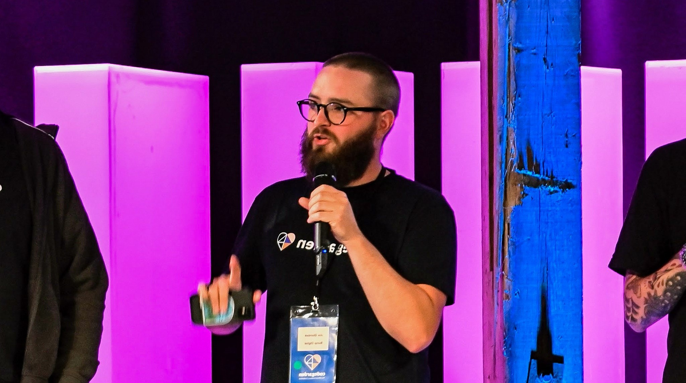

<!--
_header: ''
_backgroundImage:
_class: lead
--->

# Celibrate you're misteaks

---

<!--
_header: ''
_footer: ''
--->

## <small>Hello, my name is</small> Joe *Glombek*
*.NET* Web Developer at Bump
*Umbraco MVP*

 
 

- <i>link</i> www.**joe.gl**
- <i></i> @JoeGlombek
- <i>logo_dev</i> @JoeGlombek

---

> *Everyone* makes mistakes.

<!--- We've heard it time and again. But there's always that nagging voice inside our heads telling us to hide it away somewhere. -->
---
<!--  -->

## The cost of *hiding mistakes*

* <i>gavel</i> The wrongful conviction of *Adam Braseel*
    <small>[*Criminal* podcast #133: Red Hair, Gold Car](https://thisiscriminal.com/episode-133-red-hair-gold-car/)</small>

* <i>flight</i> TDODAR
    <small>[@CliffordAgius](https://twitter.com/CliffordAgius) talk: Pilot Critical Decision Making skills @ [NDC London](https://ndclondon.com/agenda/pilot-critical-decision-making-skills-02fl/0pdppc0kcpm)</small>
---

### *TDODAR* decision-making model

* <i>timer</i> **T**ime
* <i>troubleshoot</i> **D**iagnosis
* <i>format_list_bulleted</i> **O**ptions
* <i>filter_alt</i> **D**ecide
* <i>groups</i> **A**ssign
* <i>reviews</i> ***R**eview*

<!-- if it's good enough for pilots, it's probably good enough for us -->
---

## *Honesty* is the best policy

* <i>help</i> What impact would *admitting mistakes* have had?
* <i>help</i> Who would have been at *fault*?

---

## OK, so how does this apply to *development*?

---

## Create a *culture of sharing* <small>(that includes *sharing our mistakes*)</small>

* Learning about others' mistakes&hellip;
    * <i>sentiment_satisfied</i> &hellip;reminds us that *everyone* makes mistakes
    * <i>school</i> &hellip;saves us making the same mistake
 
* Sharing our mistakes&hellip;
    * <i>school</i> &hellip;saves our team making the same mistake
    * <i>psychology</i> &hellip;helps us remember
---

## *How* and *when*?

* <i>soap</i> Project washups
* <i>handshake</i> One-to-ones
* <i>history</i> Commit history
* <i>public</i> Code in public

<!--
We've heard it time and again. But there's always that nagging voice inside our heads telling us to hide it away somewhere. But why be ashamed?! Besides, this can lead to more mistakes in the future. We'll take a look at some of my mistakes and even look at some extreme cases where mistakes can cost lives.

As well as looking at how hiding mistakes can be damaging to our confidence as well as to our work, we'll discuss how and when to talk about our mistakes along with success stories and how highlighting past mistakes can help save time, effort, and - most importantly - shame as individuals, teams, and as a community.

Takeaways:

- An understanding of how hiding mistakes can be damaging
- How being open about past mistakes can help going forwards
- Ideas for how and when to talk about mistakes

-->